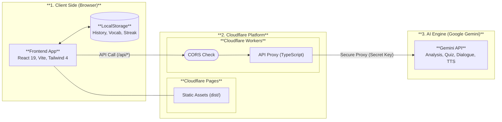
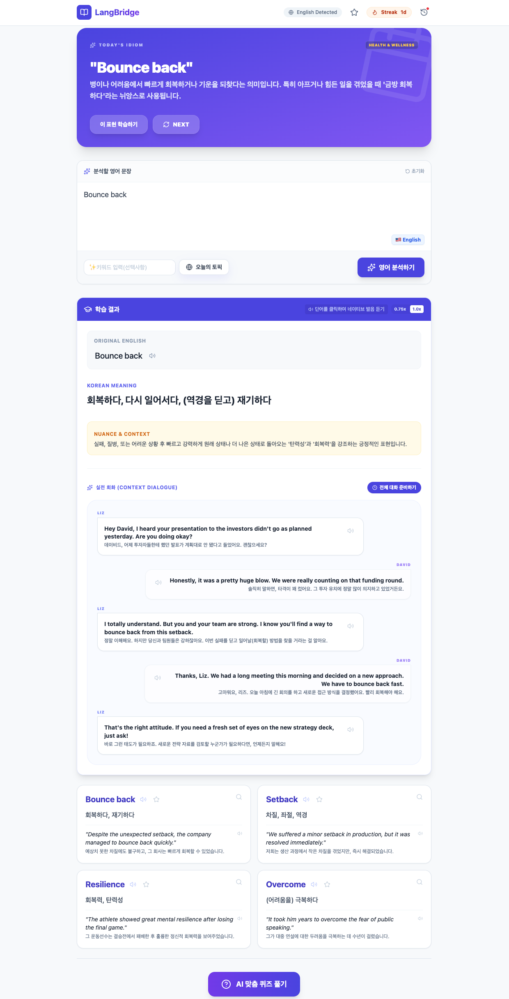

# 💬 LangBridge | LiveLoop.App 🌱

**LangBridge**는 AI(Gemini 2.0)를 활용하여 영어 학습을 더 스마트하고 즐겁게 만들어주는 모던 웹 애플리케이션입니다. 분석, 퀴즈, 다이얼로그 생성 등 다양한 학습 기능을 통해 네이티브 수준의 영어를 경험하세요.


---
> ✨ **NOTE**: 이 프로젝트는 AI의 도움을 받아 완성되었습니다.
>
> 🏠 **DEMO SITE**: https://langbridge.liveloop.app/ (AI API 스로틀링 발생으로 사용이 원할하지 않을 수 있습니다.)



## ✨ 주요 기능 (Key Features)

- **🔍 영어 분석 (AI Analysis)**: 입력한 문장의 뉘앙스, 문법, 핵심 단어를 AI가 정밀 분석합니다.
- **🎧 쉐도잉 플레이어 (Shadowing Player)**: Gemini TTS를 활용한 고품질 발음 듣기 및 속도 조절 기능.
- **💬 실전 회화 (Context Dialogue)**: 학습한 문장을 바탕으로 Liz와 David의 생생한 대화문을 생성합니다.
- **📚 나만의 단어장 (My Vocabulary)**: 학습 중 발견한 중요한 단어를 저장하고 관리하세요.
- **📝 오늘의 토픽 & 표현 (Daily Insights)**: 매일 새로운 영어 표현과 학습 주제를 추천받습니다.
- **🔥 학습 스트릭 (Study Streak)**: 매일매일 학습 습관을 유지하고 기록하세요.

## 🚀 기술 스택 (Tech Stack)

- **Frontend**: React 19, TypeScript, Vite, Tailwind CSS 4
- **Backend**: Cloudflare Workers (Serverless)
- **AI**: Google Gemini API (Analysis, Quiz, Dialogue, TTS)
- **Icons**: Lucide React
- **Testing**: Vitest, React Testing Library

## 📂 프로젝트 구조 (Project Structure)

```text
.
├── src/                # 프론트엔드 소스 코드 (React)
├── workers/api/        # 백엔드 소스 코드 (Cloudflare Workers)
├── public/             # 정적 자산 (Favicon, 등)
├── wrangler.toml       # Cloudflare 통합 배포 설정
├── README.md           # 프로젝트 가이드 (통합본)
└── LICENSE             # Apache License 2.0
```

## 🛠️ 시작하기 (Getting Started)

### 1. 전제 조건 (Prerequisites)
- Node.js (v20 이상 권장)
- [Google AI Studio](https://aistudio.google.com/)에서 발급받은 **Gemini API Key**

### 2. 로컬 개발 환경 설정
```bash
# 저장소 복제
git clone https://github.com/liks79/langbridge-liveloop-app.git
cd langbridge-liveloop-app

# 의존성 설치
npm install

# 환경 변수 설정
cp .dev.vars.example .dev.vars
# .dev.vars 파일을 열고 GEMINI_API_KEY를 입력하세요.
```

### 3. 테스트 (Testing)
프로젝트 로직이 정상 작동하는지 테스트 코드로 검증합니다.
```bash
# 전체 테스트 실행
npm run test:run
```

### 4. 실행
```bash
# 프론트엔드 실행 (http://localhost:5173)
npm run dev

# Worker 로컬 실행 (별도 터미널에서)
npx wrangler dev
```

## 🌐 배포 (Deployment)

본 프로젝트는 **Cloudflare Workers with Assets**를 통해 프론트엔드와 백엔드가 하나의 프로젝트로 통합 배포됩니다. 다음의 문서를 참고 하실 수 있습니다.
* [Cloudflare Pages 문서](https://developers.cloudflare.com/pages/)
* [Cloudflare Workers 문서](https://developers.cloudflare.com/workers/)
* [Cloudflare Dashboard Variables(환경 변수) 문서](https://developers.cloudflare.com/workers/configuration/environment-variables/)

### 통합 배포 커맨드
```bash
# 빌드 및 배포
npm run build
npx wrangler versions upload
```

### 필수 환경 변수 설정 (Cloudflare Dashboard)
배포 후 Cloudflare Dashboard의 **Settings > Variables**에서 다음 항목을 반드시 설정해야 합니다:
- `GEMINI_API_KEY`: Google AI Studio에서 발급받은 API 키
- `ALLOWED_ORIGINS`: 허용할 도메인 (예: `https://langbridge.example.com`)

## 🛡️ 보안 및 아키텍처 (Security & Architecture)

- **CORS 제한**: `ALLOWED_ORIGINS` 설정을 통해 지정된 도메인에서만 API 호출을 허용합니다.
- **통합 라우팅**: 같은 도메인 내에서 `/api/*` 경로를 통해 Worker와 통신하므로 보안과 성능이 우수합니다.
- **Zero Trust**: 필요한 경우 Cloudflare Access를 연동하여 사이트 전체를 보호할 수 있습니다.

## 📄 라이선스 (License)

이 프로젝트는 [Apache License 2.0](./LICENSE)를 따릅니다.

---

Built with ❤️ by [LiveLoop.App](https://liveloop.app)
